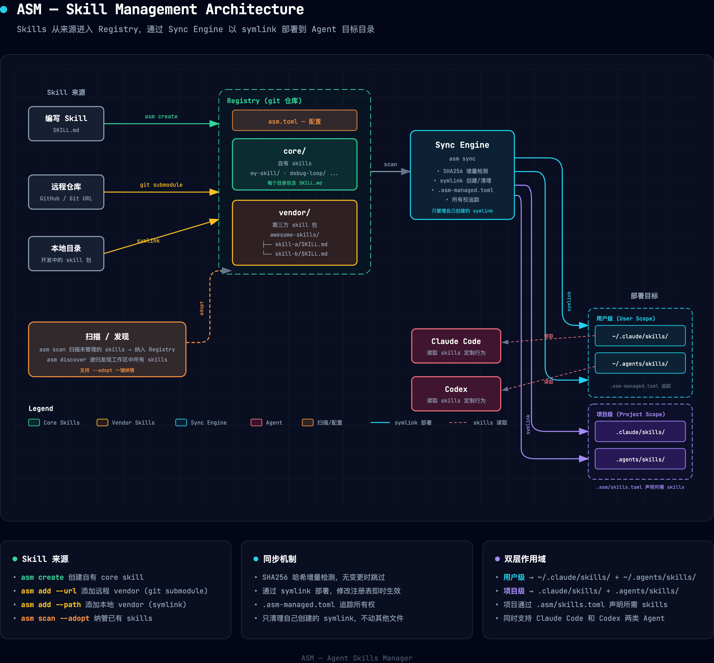

# ASM — Agent Skills Manager

集中管理 [Claude Code](https://docs.anthropic.com/en/docs/claude-code)、[Codex](https://openai.com/index/introducing-codex/) 和 [Kiro](https://kiro.dev/) Skills 的 CLI 工具。通过中央注册表统一安装、创建、同步和发现 Skills，基于 symlink 部署到各 agent 目录。

## 为什么需要 ASM？

Claude Code、Codex 和 Kiro 等 AI 编程 agent 支持 **Skills** — 用 Markdown 文件定制 agent 行为。随着 skill 数量增长，手动管理变得越来越痛苦：

- Skills 散落在 `~/.claude/skills/`、`~/.agents/skills/`、`~/.kiro/skills/` 和各项目目录中
- 无法跨机器、跨团队共享
- 不清楚哪些 skill 装在了哪里

ASM 通过一个 **中央注册表**（git 仓库）作为唯一数据源来解决这些问题。Skills 通过 symlink 从注册表部署到 agent 目录，更新即时生效。

## 安装

需要 [Bun](https://bun.sh) v1.2+。

```bash
# 克隆并构建
git clone https://github.com/xinnyu/agent-skills-manager.git
cd agent-skills-manager
bun install
bun run build        # 编译为独立二进制 dist/asm
bun run link         # 软链接到 /usr/local/bin/asm
```

## 快速开始

```bash
# 1. 初始化注册表（存放所有 skill 的目录）
mkdir ~/asm-skills && cd ~/asm-skills && git init
asm init .

# 2. 创建第一个 skill
asm create my-skill
# 编辑 core/my-skill/SKILL.md 填写 skill 内容

# 3. 同步到 agent 目录
asm sync
# symlink 会创建到 ~/.claude/skills/、~/.agents/skills/ 和 ~/.kiro/skills/

# 4. 从 GitHub 添加第三方 skill 包
asm add awesome-skills --url https://github.com/user/awesome-skills.git

# 5. 查看已安装的 skills
asm list

# 6. 检查 skill 与 companion CLI 是否版本漂移
asm doctor
# 需要时按 asm.toml 里声明的策略修复 CLI
asm doctor --fix
# 或在升级 skill 时一并修：
asm upgrade --runtime
```

### Companion runtime

部分 vendor（如 opencli、sim-use）是 **skill 文档 + CLI 同仓**。`asm upgrade` 默认只更新 skill 内容，并报告 CLI 漂移；加 `--runtime` 才按声明策略安装/升级 binary。

在 `asm.toml` 里声明：

```toml
[vendor.sim-use]
url = "https://github.com/lycorp-jp/sim-use"

[vendor.sim-use.runtime]
bin = "sim-use"
version_from = "git-tag"

[vendor.sim-use.runtime.install]
preferred = "brew"
brew = "lycorp-jp/tap/sim-use"
```

vendor 仓也可自带 `asm.runtime.toml`；本地 `asm.toml` 覆盖优先。

## 架构



## 核心概念

### 注册表（Registry）

一个 git 管理的目录，存放所有 skill 源文件：

```
~/asm-skills/
├── asm.toml          # 注册表配置
├── core/             # 自己创建的 skills
│   └── my-skill/
│       └── SKILL.md
└── vendor/           # 第三方 skill 包
    └── awesome-skills/
        ├── skill-a/
        │   └── SKILL.md
        └── skill-b/
            └── SKILL.md
```

### Skill 格式

每个 skill 是一个包含 `SKILL.md` 的目录，使用 YAML frontmatter：

```markdown
---
name: my-skill
description: 这个 skill 做什么
---

Skill 指令内容...
```

### 目标目录（Targets）

symlink 部署到的 agent 目录：

| 目标 | 目录 |
|------|------|
| Claude Code | `~/.claude/skills/` |
| Codex | `~/.agents/skills/` |
| Kiro | `~/.kiro/skills/` |

### 作用域（Scope）

- **用户级（user）** — skill 同步到全局 agent 目录（`~/.claude/skills/`、`~/.agents/skills/`、`~/.kiro/skills/`）
- **项目级（project）** — skill 同步到项目本地目录（`.claude/skills/`、`.agents/skills/`），通过 `.asm/skills.toml` 清单声明

## 命令一览

| 命令 | 说明 |
|------|------|
| `asm init [path]` | 初始化 skill 注册表目录 |
| `asm create <name>` | 创建新的 core skill，遵循 Anthropic 官方 [Skills 规范](https://docs.anthropic.com/en/docs/claude-code/skills)（SKILL.md + YAML frontmatter），创建后自动同步部署 |
| `asm add <name> --url <git-url>` | 添加远程 vendor 包（git submodule） |
| `asm add <name> --path <local-path>` | 添加本地 vendor 包（symlink，修改即时生效） |
| `asm remove <name>` | 移除 skill 或 vendor 包 |
| `asm list` | 列出所有已安装的 skills |
| `asm info <name>` | 查看 skill 详情 |
| `asm sync` | 同步 symlink，使注册表与目标目录保持一致 |
| `asm upgrade [--dry-run]` | 检查并更新 vendor 包 |
| `asm scan [--adopt] [--auto] [--dry-run]` | 扫描目标目录中未被 ASM 管理的 skills |
| `asm discover [--roots <dirs>] [--json]` | 递归发现工作区中所有 skills |

## 配置文件

### `~/.asmrc`

指向当前活跃的注册表目录：

```
/Users/you/asm-skills
```

### `<registry>/asm.toml`

注册表级别配置：

```toml
[config]
default_scope = "user"

[targets]
claude = "~/.claude/skills"
codex = "~/.agents/skills"
kiro = "~/.kiro/skills"

[vendor.awesome-skills]
url = "https://github.com/user/awesome-skills.git"
```

### `.asm/skills.toml`

项目级别清单 — 声明需要同步到项目中的 skills：

```toml
skills = ["my-skill", "code-review"]
vendors = ["awesome-skills"]
```

## 开发

```bash
bun install          # 安装依赖
bun run dev          # 开发模式运行 CLI
bun test             # 运行测试
bun run lint         # 代码检查
bun run typecheck    # 类型检查
```

## 技术栈

- **运行时：** [Bun](https://bun.sh)
- **语言：** TypeScript
- **CLI 框架：** [Commander.js](https://github.com/tj/commander.js)
- **配置格式：** TOML（[smol-toml](https://github.com/nicolo-ribaudo/smol-toml)）

## License

MIT
